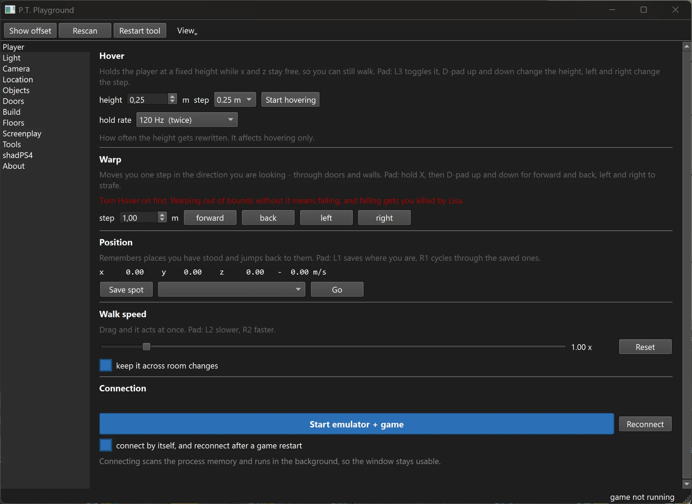

# P.T. Playground

Live tools and an archive patcher for **P.T.** (CUSA01127) running under
[shadPS4](https://github.com/shadps4-emu/shadPS4).

It reads and writes the memory of the running game, and it rewrites the game's
own archives to change things that cannot be changed at runtime.

## What it does

* **Player**: hover above the floor, warp, save and cycle spots, walk speed
* **Light**: flashlight colour and brightness, exposure and its ceiling
* **Camera**: a free camera, detached from the player, on keyboard or gamepad
* **Location**: where you are, which floor, what is behind the next door
* **Objects**: show the objects P.T. keeps hidden
* **Doors**: unlock
* **Build**: patch the archive with stage, flashlight range, spawn a gimmick
* **Floors**: what each lap arms
* **Tools**: texture streaming, the texture detail level, `texture.qar`,
  savegame handling, paths

Plus a set of command line tools for the archive formats themselves: PSARC,
FPK/FPKD, FOX2, QAR and the PFTXS texture packs.

## Requirements

* Windows, Python 3
* PySide6 (`pip install PySide6`) for the interface
* The rest of `requirements.txt` only for individual command line tools
* A running shadPS4 with your own copy of P.T.

Start the interface with `python ptqt.py`. Paths to shadPS4 and to the game
are set on the Tools page and kept in `playground.json`.

## Tested against

shadPS4 **v0.18.1 WIP** (`v0.18.0-90-gf42f72d6`), built from source with pull
request [#4581](https://github.com/shadps4-emu/shadPS4/pull/4581) applied and
nothing else. Earlier work was done on v0.17.1 WIP (`4cc54cd`). An official
build works too; it just crashes more often.

Addresses are resolved against the loaded game module rather than against fixed
emulator offsets, so an emulator update should not invalidate them. That is the
design, not a guarantee.

## Crashes

P.T. under shadPS4 crashes fairly often at start. Nothing in this tool
depends on this.

One crash does have a named cause. `GetBarriers` in `image.cpp` trips an
assertion because `SubresourceExtent` is compared through the defaulted
`operator<=>`, which is lexicographic. `levels` counts first, `layers` only on a tie.
P.T.'s cube maps request `{levels=1, layers=6}` while the cache holds
`{levels=3, layers=1}`; `3 < 1` is false, so the image is never recreated and
five of its six faces are never uploaded.

Pull request [#4581](https://github.com/shadps4-emu/shadPS4/pull/4581) fixes
exactly that. It has been open since June 2026 and is still unmerged. The build
used here is stock `f42f72d6` with that pull request applied and no other
change. Neither the emulator nor the patch is part of this repository.

## The texture problem is a different one

Textures fall apart into stripes while `texture.qar` is in place. That
archive holds the upper mip levels as separate streams: without it a 2048 px
texture effectively renders at 64 px, blurry but stable. With it the detail is
there and decays as you approach.

**Pull request #4581 does not fix this, and most likely has nothing to do with
it.** That was tested head-on: stock `f42f72d6`, the pull request applied on its
own, no other local changes, `texture.qar` active and the mip grade change not
suppressed. The striping was exactly as before.

They are two independent faults. The pull request addresses the subresource
comparison and the crash that follows from it. The striping points somewhere else.
The working hypothesis, unproven, is that the game moves texture data into place
with a GPU copy that shadPS4 does not record as GPU-modified, so the upload
comes from guest memory that was never written.

What does help is freezing the mip level. The Tools page writes
`GrTools():SuppressGradeChange()` into the archive's `init.lua`, and the detail
level then stops changing, so nothing decays, at the price of staying at
whatever level was loaded. Maybe blurry, low quality, but stable and without
touching any gamefiles. And the change is reversible from the same page.

Every P.T. issue on the shadPS4 tracker is closed, two of them within a day of
being opened, and the only open item is the pull request above. So you can imagine
how much attention the game (the demo) will get in the future. It's a shame, really,
because it's a piece of video game history.

## No game assets

This repository contains source code only. Nothing from the game is included,
and nothing is needed to build it. Everything the tool touches has to be on
your machine already, from your own copy of P.T.

The caches some tools keep (symbol indexes, decompilation maps, extracted
scripts) are deliberately not in the repository; each tool rebuilds its own.

## No support

Published as it is. Issues are closed, there is no support and no roadmap.
Read it, use it, fork it, change it, but nothing here comes with a promise
that it will work on your machine.

## Acknowledgements

**Lance McDonald.** For the original ideas of floating the player above the
floor and of detaching the camera from him, to reach and to see the parts of
P.T. it does not let you walk to. Credited as their originator, not as a
contributor here.

**The shadPS4 developers.** None of this exists without the emulator. P.T. is
not a title they owe anyone anything for; it runs at all because of their work.

**P.T. shadPS4 texture workarounds by loreanxavier.** The `chunk1` workarounds.
Without his work, developing the tool and working on the game would have
been much more difficult, at least at the beginning.
By the way, this archive doesn't include the textures for the street area.
<https://www.moddb.com/mods/pt-shadps4-texture-workarounds>

**Anthropic.** This tool is vibecoded end to end. Every line of it was written
by Claude (Opus 5), against findings confirmed in the running game.

## Licence

MIT with an attribution requirement, see `LICENSE`. Copy, change and
redistribute freely, including commercially. The one condition: the copyright
notice, the licence text and the credits stay intact. Add your own name for
what you changed; do not remove the existing entries.

## The game

Deliberately not in the list above. That list is for people whose work this
tool builds on, and the people who made P.T. did not contribute to it. They
made the thing it is for.

P.T. was released in August 2014 under the studio name **7780s Studio**, which
was **Kojima Productions**, published by **Konami Digital Entertainment**, and
directed by **Hideo Kojima** together with **Guillermo del Toro**.

**Thank you, Hideo Kojima.** P.T. gets more out of a single corridor than most
games get out of an entire world, and it is the reason this tool exists at
all. Taking it apart only made the respect for it bigger.

It was delisted in April 2015 and has never been rereleased. It cannot be
bought any more, only kept by those who already have a copy. I think that is a
real shame. A work like this should not depend on whether you happened to
reach for it in time, and not wanting to watch it quietly disappear is a good
part of why this tool exists.

Named here out of respect, not as an endorsement of any kind.

## Unofficial

P.T. and Silent Hills are property of Konami Digital Entertainment. This is a
fan tool, not affiliated with or endorsed by Konami, Kojima Productions or the
shadPS4 project.
